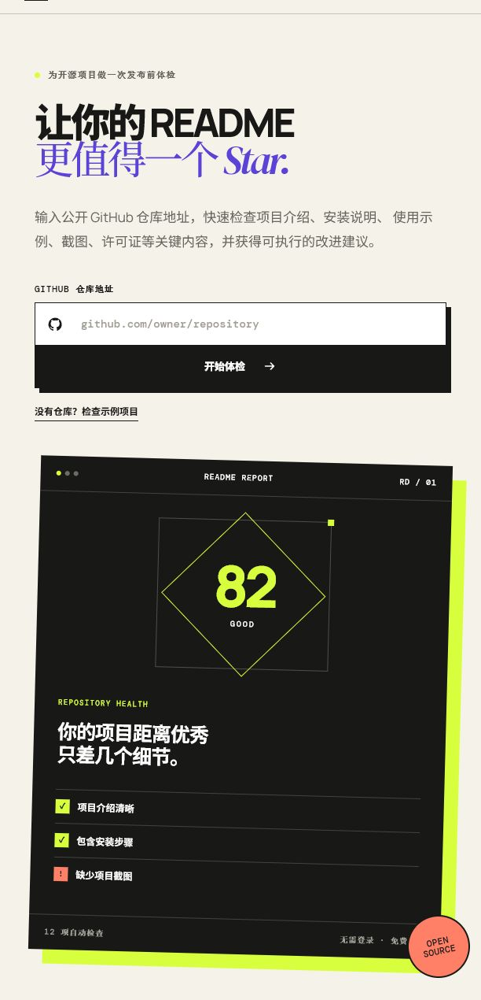

# Readme Doctor

[](https://github.com/qboiii821-ctrl/readme-doctor/actions/workflows/deploy-pages.yml)
[](LICENSE)
[](https://react.dev/)

> 让你的 README 更值得一个 Star。

Readme Doctor 是一个免费的 GitHub README 体检工具。输入公开仓库地址，即可获得 100 分制评分、12 项检查结果和优先改进建议。

**[立即在线体验](https://qboiii821-ctrl.github.io/readme-doctor/)**



## 为什么做这个项目

很多认真完成的项目，因为 README 缺少安装说明、使用示例或截图，让访客无法快速理解它的价值。

Readme Doctor 希望用一份简单、明确的报告，帮助开发者在发布项目前发现这些问题。

## 功能

- 支持 GitHub 完整链接和 `owner/repository` 简写
- 自动读取公开仓库的 README 与仓库资料
- 检查项目介绍、安装步骤、使用说明、截图、许可证等 12 项内容
- 提供 100 分制评分和三条优先改进建议
- 无需登录，不上传代码
- 支持桌面端和移动端

## 检查项目

| 项目 | 检查内容 |
| --- | --- |
| README 文件 | 仓库是否包含可读取的 README |
| 项目介绍 | 是否清晰说明项目价值 |
| 安装步骤 | 是否提供可复制的安装命令 |
| 使用说明 | 是否包含最短可用示例 |
| 截图或演示 | 是否展示项目实际效果 |
| 开源许可证 | 是否包含 LICENSE |
| 贡献指南 | 是否说明 Issue 和 Pull Request 流程 |
| 状态徽章 | 是否展示构建、版本或许可证状态 |
| 代码示例 | 是否包含 Markdown 代码块 |
| 内容结构 | 标题层级是否清晰 |
| 相关链接 | 是否提供演示、文档或反馈入口 |
| 仓库资料 | GitHub About 信息是否完整 |

## 本地运行

需要安装 [Node.js](https://nodejs.org/) 20 或更高版本。

```bash
git clone https://github.com/qboiii821-ctrl/readme-doctor.git
cd readme-doctor
npm install
npm run dev
```

打开终端显示的本地地址，通常为 `http://localhost:5173`。

## 可用命令

```bash
npm run dev      # 启动开发服务器
npm run build    # 创建生产构建
npm run lint     # 检查代码质量
npm run preview  # 预览生产构建
```

## 技术栈

- React 19
- TypeScript
- Vite
- GitHub REST API
- GitHub Actions
- GitHub Pages

## 路线图

- [x] README 评分与改进建议
- [x] GitHub Pages 在线版本
- [x] 响应式界面
- [ ] [提供英文版 README](https://github.com/qboiii821-ctrl/readme-doctor/issues/1)
- [ ] 生成可复制的 README 模板
- [ ] 支持分享体检报告

## 参与贡献

欢迎提交 Issue 或 Pull Request。开始前请阅读 [贡献指南](CONTRIBUTING.md)。

如果这个项目对你有帮助，可以点一个 Star，让更多开发者发现它。

## 许可证

本项目使用 [MIT License](LICENSE)。
